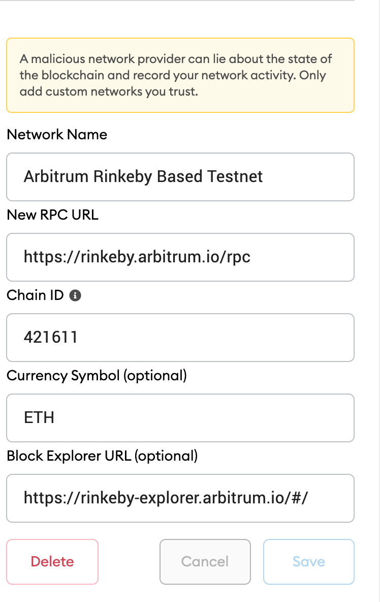

# Lottery smart contracts
Player must submit a minimum ammount of 0.02 ETH to enter into the lottery pool. After all players have entered, the manger address(account that deployed contract) can call the pickWinner() function. The winning will be picked using Chainlink VRF random generator and the winning address with receive all ETH in the lottery pool. After the lottery winner is selected the smart contacts state will reset and a new lottery round can start.

# Network Dapp support
1. Ropsten Ethereum test network(v1)
2. Kovan Ethereum test network(v1,v2)
3. Rinkeby Ethereum test network(v2)
3. Arbitrum Rinkeby(comming soon)

dApp is currenlty using v2 smart contract with the support Chainlink VRF to generator numbers 

# Contract deployed
1. Ropsten contract address(v1): 0x4e781145626e90d438b1A5D035ECc8A1198358C2
- https://ropsten.etherscan.io/address/0x4e781145626e90d438b1A5D035ECc8A1198358C2

2. Kovan Contract address(v1): 0xE412A7396AcC914Ee9F026B4DF3E0AF0034D9ce5
- https://kovan.etherscan.io/address/0xE412A7396AcC914Ee9F026B4DF3E0AF0034D9ce5

2. Kovan Contract address:(v2) 0x94CF0FdEFBe4B2F6B2b3E5f2745E86B0b87C6b3f
- https://kovan.etherscan.io/address/0x94CF0FdEFBe4B2F6B2b3E5f2745E86B0b87C6b3f

2. Rinkeby Contract address:(v2) 0xE412A7396AcC914Ee9F026B4DF3E0AF0034D9ce5
- https://rinkeby.etherscan.io/address/0xE412A7396AcC914Ee9F026B4DF3E0AF0034D9ce5

# Running locally
1. npm install
2. start local Ganache blockchain
3. npm run deploy:contract:dev
4. npm run start
5. navigate to http://localhost:3000/
6. enter into lottery

# Migrating Contract Ethereum Test Network
1. Duplicate the .en.example file and rename it .env. Populate your environment variables .env see .env blow
```sh
PRIVATE_KEYS="DRVE4335G55656555JJJFDDS3"
INFURA_API_KEY=JJJSFB55554BJG4
```
> :warning: When pushing your code to Github, make sure that your **PRIVATE_KEYS** and **INFURA_API_KEY** are stored in a **.env** file and it is also in your **.gitignore**

2. Run deployment scipts
- note: Make sure the account that owns the private key in your .evn has enough ETH balance for the 
network you want to deploy to.
```sh
deploy:contract:kovan
```
```sh
deploy:contract:rinkeby
```
```sh
deploy:contract:ropsten
```

# Layer 2 scaling soultion Abritrum
- https://developer.offchainlabs.com/docs/inside_arbitrum

## Arbitrum Box
- https://www.trufflesuite.com/blog/truffle-and-infura-support-arbitrum
- https://github.com/truffle-box/arbitrum-box
- box: https://www.trufflesuite.com/boxes/arbitrum

## Configure Metamask networks for Arbitrum Networks
[You can read up on Arbitrum network configuration, bridge and other important contract accounts here](https://github.com/OffchainLabs/arbitrum/blob/master/docs/Public_Testnet.md)

- Setup networks in Metamask, see images below 

<span>
</span>

## Migrating contracts Arbitrum Rinkeby
To bridge some value eg ETH to Arbitrum_Rinkey go to [https://bridge.arbitrum.io/](https://bridge.arbitrum.io/),
ensure Metamask is on Rinkeby network and deposit some funds into Arbitrum_Rinkeby. 

- Setup Infura. If not already added arbitrum network as add-on, got to [infura.io](infura.io) under your account settings
go to Billing. In Billing, Click Manage Add-Ons. Select Arbitrum Rollup and add with your card(there is no charge).


- Migrate
```sh
npm run deploy:arbitrum:arbitrum_testnet
```
[View on Arbitrum Testnet Scan here](https://rinkeby-explorer.arbitrum.io/#/)

## Tech stack
1. AWS Amplify to host client side app
2. Ether
3. React
4. Solidity
5. truffle
6. [Chainlink VRF](https://docs.chain.link/docs/chainlink-vrf/)
7. web3
8. React-redux

## TODO
- Add support for Arbitrum Layer 2